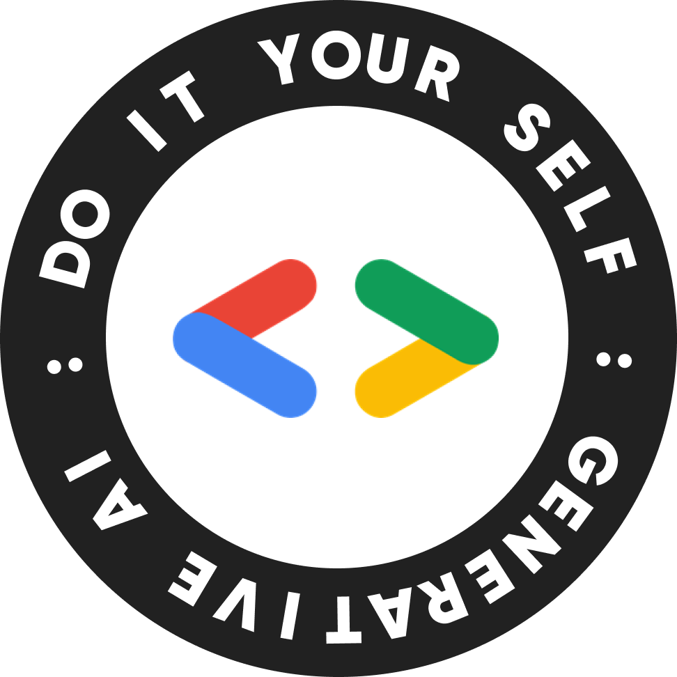
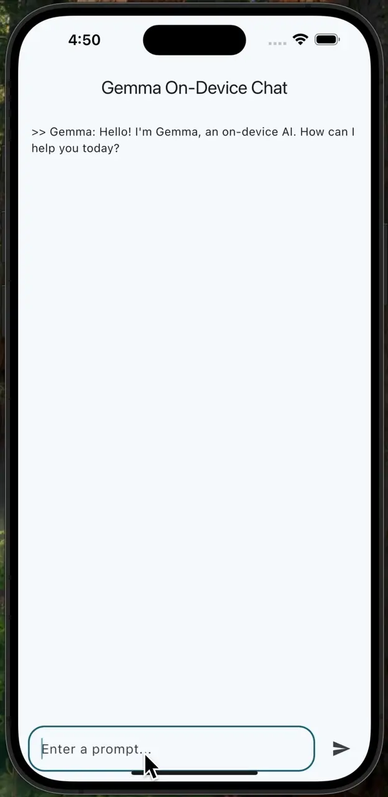

<h1 align="center">Gemma 3 Chat App on Flutter</h1>
<p align="center">A sample Flutter application for Gemma3 Edge-serving</p>
<div align="center">
<table>
<tr>
<td></td>
<td></td>
<td></td>
</tr>
</table>
</div>


This is a sample Flutter application demonstrating how to run Google's Gemma 3 (1B variant) language model entirely on an iOS device using the MediaPipe GenAI package. The app provides a simple chat interface for on-device inference with real-time, token-by-token streaming responses.

This repository serves as the practical, hands-on counterpart to our detailed **[Medium Article](https://medium.com/@kennethan/building-an-on-device-gemma-3-chat-app-with-flutter-baaa53de69e3)**, which explains the development journey in more detail.

<p align="center"></p>

## Overview

The goal of this project is to showcase a practical implementation of on-device AI. By running the LLM locally, the application benefits from:

- **Privacy:** User prompts are never sent to a server.
- **Offline Capability:** The core chat functionality works without an internet connection.
- **Low Latency:** Responses are generated directly on the device, reducing network delays.

## Tech Stack

- **AI Model:** Google Gemma 3 (`gemma3-1B-it-int4.task`)
- **Flutter:** `master` channel (required for experimental features)
- **Inference Engine:** `mediapipe_genai` & `mediapipe_core` packages
- **Platform:** iOS (using a manually configured `Podfile`)

## Getting Started

This project relies on bleeding-edge features. Please follow these instructions carefully.

### Prerequisites

- Flutter SDK installed on the `master` channel.
- Xcode and CocoaPods for iOS development.

### Build Instructions

1.  **Clone the Repository**

    ```bash
    git clone https://github.com/KennethanCeyer/gemma3-chat-app.git
    cd gemma3-chat-app
    ```

2.  **Download the Gemma 3 Model**
    This project is configured to use the `gemma3-1B-it-int4.task` model.

    - Go to the model's official page on Kaggle: [Gemma on Kaggle](https://www.kaggle.com/models/google/gemma/frameworks/tensorFlowLite/variations/gemma-3-1b-it-int4-task)
    - Download the `.task` file.
    - Create an `assets` folder in your project root and place the downloaded file inside. The final path must be `assets/gemma3-1B-it-int4.task`.

3.  **Configure Flutter**
    This is a one-time command for this project.

    ```bash
    flutter config --enable-native-assets
    ```

4.  **Install Dependencies**
    First, get the Dart packages, then install the native iOS pods.

    ```bash
    flutter pub get
    cd ios
    pod install
    cd ..
    ```

5.  **Run the App**
    Make sure your iOS Simulator is running or a device is connected.
    ```bash
    flutter run
    ```
    The first launch will be slow as it copies the model file to the app's local storage. Subsequent launches will be much faster.

## Key Workarounds Implemented

- **Manual `Podfile`:** The current Flutter toolchain on the `master` channel does not automatically link the required native libraries for this package. We solved this by manually creating an `ios/Podfile` and adding the `MediaPipeTasksGenAI` and `MediaPipeTasksGenAIC` pods.

## License

This project is licensed under the MIT License. See the [LICENSE](LICENSE) file for details.
